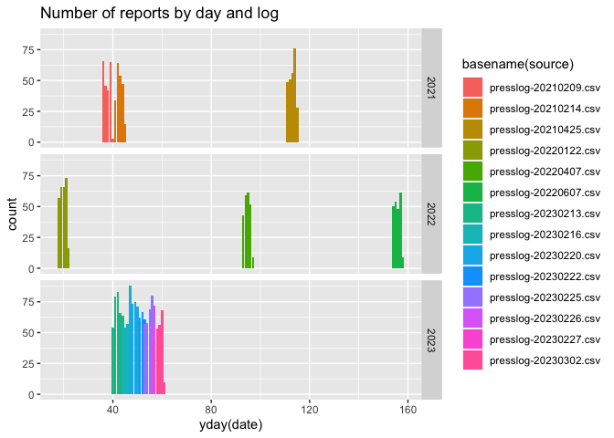

<!-- README.md is generated from README.Rmd. Please edit the README.Rmd file -->

# Lab report

The main structure of this repo is given by three folders:

    -- code
    |   |-- scrape-presslog.R       # contains functions one_page and duplicates
    -- data
    |   |-- presslog-20210209.csv   # data files in csv form   
    ...
    |   |-- presslog-20230220.csv
    -- presslogs                    # pdf files of press logs

<!-- --><!-- -->

## Details on each part of the lab

Load packages

``` r
library(tidyverse, quietly = TRUE)
library(tabulizer)
library(lubridate, quietly = TRUE)
```

The duplicates function takes a character string and checks whether it
consists of a long string of duplicate entries. In that case, only the
first value is returned.

``` r
duplicates <- function(string) {
  # find the first '\r', delete everything afterwards
  # str_locate(string, pattern='\r')
  stopifnot(length(string)==1)
  splitter <- strsplit(string, split="\r")
  res <- unique(splitter[[1]])
  if (length(res) > 1) warning(sprintf("Multiple different values found in string: %s", paste(res, collapse=",")))
  res[1]
}
```

The `one_page` function takes a matrix of entries from the Ames Press
Log and returns a data frame of the data in cleaner form. Note that we
only return columns that have a name and are not all empty.

``` r
one_page <- function(plogi) {
  # take one of the pages, make into a data frame
  
  # Variables are in the first data row:
  variables <- plogi[1,]
  # remove the '\r'
  variables <- gsub("\r"," ", variables)
  
  plogi <- plogi[-1,, drop=FALSE]
  
  for (i in 1:ncol(plogi))
    plogi[,i] <- plogi[,i] %>% purrr::map_chr(.f = duplicates)
  
  # remove empty columns
  idx <- which(variables == "")
  if (length(idx) > 0) {
    if (all(is.na(plogi[,idx]))) {
      plogi <- plogi[,-idx, drop=FALSE]
      variables <- variables[-idx]
    }
  }
  dframe <- as_tibble(plogi, .name_repair = "minimal") 
  names(dframe) <- variables
  
  dframe <- dframe %>% mutate(
    `Incident ID` = parse_number(`Incident ID`),
    `Report Number Assigned to Event` = parse_number(`Report Number Assigned to Event`)
  )
  dframe
}
```

Download the current press log, save it into a file called
PressLog-XXX.pdf, where XXX contains a string of today’s date.

``` r
todays_pdf <- sprintf("presslogs/PressLog-%s.pdf", lubridate::today())
if (!file.exists(todays_pdf)) # only download once
  download.file("https://data.city.ames.ia.us/publicinformation/PressLog.pdf", 
                destfile = sprintf("presslogs/PressLog-%s.pdf", lubridate::today()))

todays_pdf <- sprintf("presslogs/PressLog-%s.pdf", lubridate::today())
```

We are using the `tabulizer` functionality to extract values from the
pdf. We specify the output to be a matrix using the method lattice (to
reduce the number of possible return values).

``` r
plog <- extract_tables(todays_pdf, output='matrix',  method="lattice")

# extract the data one page at a time, combine the result into one data frame
all_pages <- plog %>% purrr::map_df(.f = one_page)

# the save the values into a csv file
date <- lubridate::today()
write_csv(all_pages, file=sprintf("data/presslog-%s%02d%02d.csv",year(date), 
                                  month(date), mday(date)))
```

Get the call codes by running the `locate_areas` function on one of the
pdfs:

``` r
foo <- locate_areas(todays_pdf, pages=1)
```

``` r
codes <- c(474.79543,  20.19263, 546.14273, 747.12743)
names(codes) <- c("top", "left", "bottom", "right")

date <- c(31.90366, 700.01128,  49.40395, 764.62771 )
names(date) <- c("top", "left", "bottom", "right")

title <- c(39.98072, 142.69461,  65.55805, 652.89514)
names(title) <- c("top", "left", "bottom", "right")
```

``` r
call_codes <- extract_tables(todays_pdf, pages=1, area = list(codes), guess = FALSE)

# turn all the codes into a single string
call_codes <- as.vector(paste(call_codes[[1]][,1], collapse = ""))

# now split the string along each comma:
codes_list <- str_split(call_codes, pattern=",")[[1]]

# get rid of leading and trailing white spaces
codes_list <- trimws(codes_list)

# now split the string along each equal symbol:
codes <- str_split(codes_list, pattern="=")
codes_df <- codes %>% purrr::map(.f = function(x) {
  list(code = x[1], description = x[2])
  }) %>% transpose() %>% as_tibble %>% unnest(cols = 1:2)

write.csv(codes_df, "data/call_codes.csv")
```

Process all of the other pdf files.

``` r
pdfs <- dir("presslogs", pattern="pdf", full.names = TRUE)
# remove today's press log:
pdfs <- setdiff(pdfs, todays_pdf)

for (pdf_file in pdfs) {
  plog <- extract_tables(pdf_file, output='matrix', method="lattice")
  
  all_pages <- plog %>% purrr::map_df(.f = one_page)
  date <- lubridate::mdy_hm(all_pages$`Call Received Date/Time`[1])
  write_csv(all_pages, file=sprintf("data/presslog-%s%02d%02d.csv",year(date), 
                                    month(date), mday(date)))
}
```
